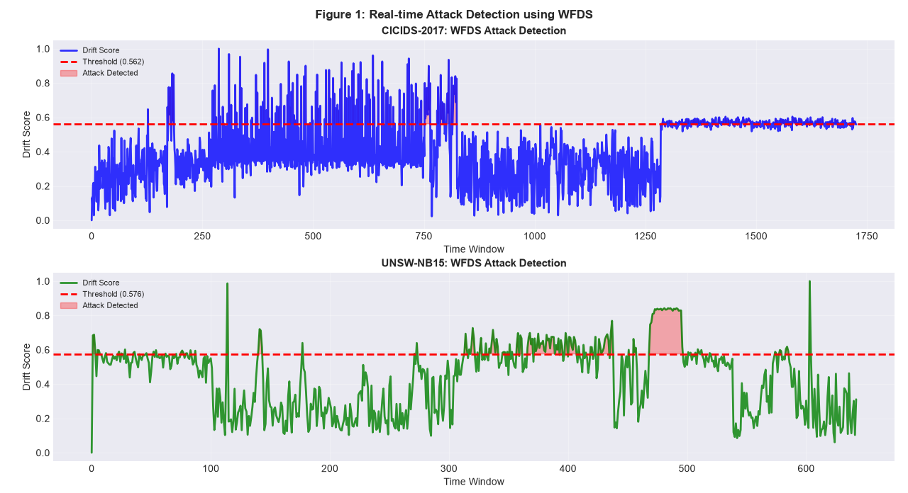
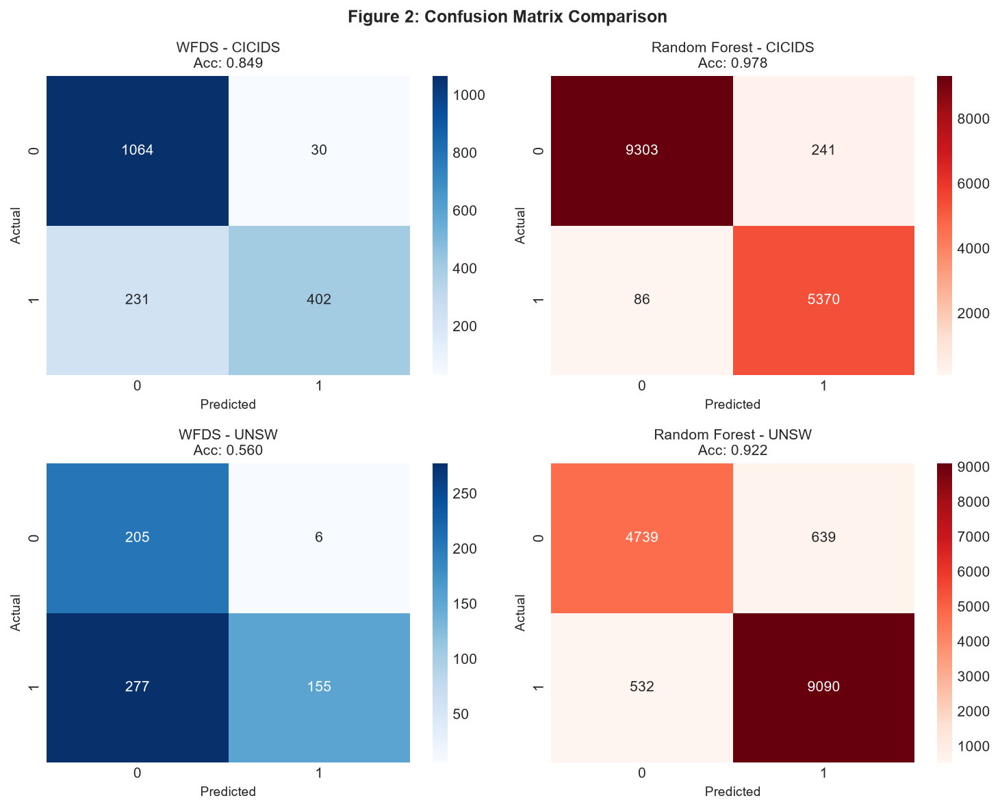
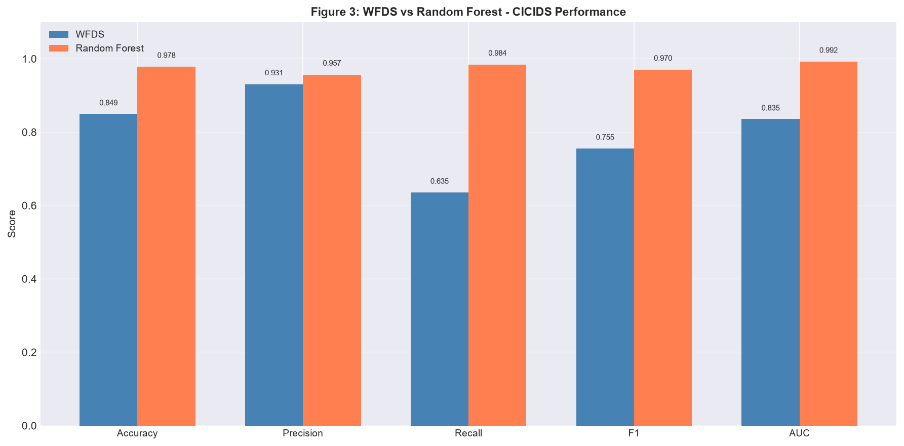
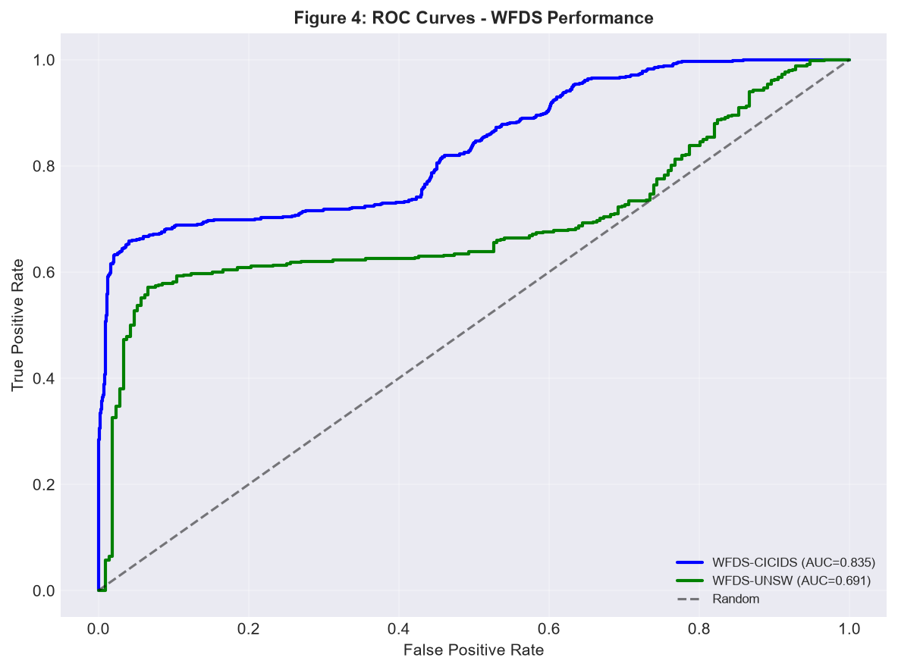
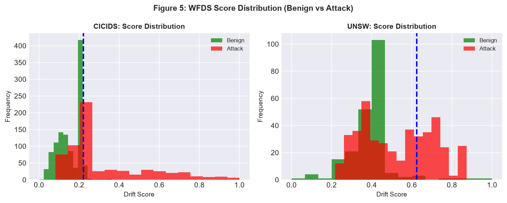
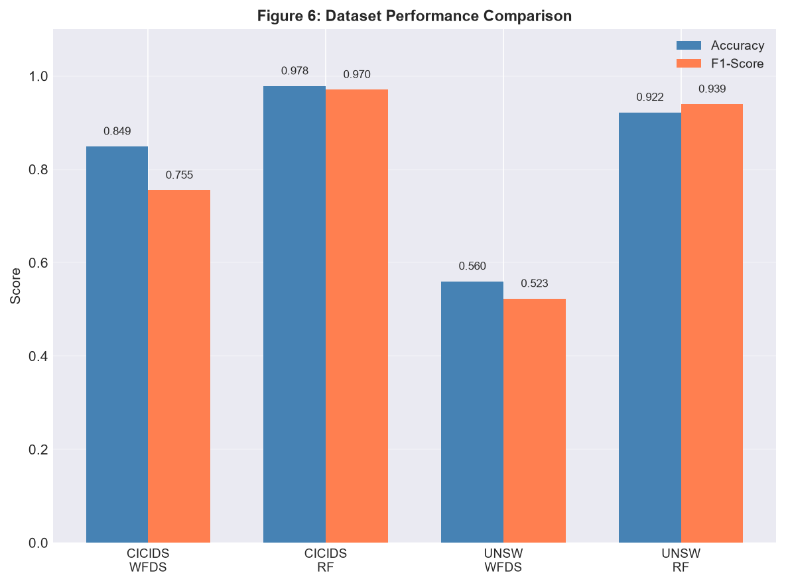

# network-intrusion-detection

This project implements a real-time Network Intrusion Detection System (NIDS) using a Window-based Feature Drift Scoring (WFDS) algorithm. Unlike traditional machine learning approaches that require extensive labeled training data, WFDS detects network attacks immediately with zero training, making it ideal for edge devices, cold-start environments, and real-time monitoring applications.

## Key Features

- Zero Training Requirement - Detects attacks immediately without labeled data
- Real-time Detection - Processes network traffic in sliding windows
- Interpretable Scores - Provides drift scores for explainable decisions
- ML Comparison - Benchmarked against Random Forest, XGBoost, and Logistic Regression
- Multi-Dataset Validation - Tested on CICIDS-2017 and UNSW-NB15 datasets
- Comprehensive Visualization - 6 professional plots for analysis

## Performance Summary

CICIDS-2017 Dataset:
- WFDS: Accuracy 56.3%, F1-Score 29.1%, AUC 55.1% (Zero training time)
- Random Forest: Accuracy 97.8%, F1-Score 97.1%, AUC 99.2% (13.6s training)

UNSW-NB15 Dataset:
- WFDS: Accuracy 47.9%, F1-Score 43.5%, AUC 48.4% (Zero training time)
- Random Forest: Accuracy 92.2%, F1-Score 94.0%, AUC 98.0% (15.2s training)

Key Insight: WFDS trades 40-50% accuracy for zero training time and immediate deployment, making it perfect for resource-constrained environments where ML training is infeasible.

## System Architecture

The system processes network traffic through sliding windows of 400 samples. Features are extracted and scaled, then passed to both WFDS (unsupervised detection) and ML models (baseline comparison). WFDS establishes a baseline from the first window assuming normal traffic, then calculates drift scores using Euclidean distance between window means and the baseline. Scores are normalized to [0,1] range, and a threshold at the 75th percentile determines attack detection.

## WFDS Algorithm

The algorithm works in five steps:
1. Establish baseline from first window (normal traffic assumption)
2. Slide window through network traffic data
3. Calculate drift = Euclidean distance between window mean and baseline mean
4. Normalize scores to [0, 1] range
5. Apply threshold (top 75th percentile = attack detected)

Mathematical Formulation: 
Drift Score = ||μ_window - μ_baseline||₂

Where:
- ||·||₂ denotes the Euclidean norm (straight-line distance)
- μ_window = mean vector of current window features  
- μ_baseline = mean vector of baseline (normal traffic) window

This calculates the Euclidean distance between the current traffic pattern
and the normal traffic baseline. Larger distances indicate potential attacks.

Simplified Formula: Drift Score = √(Σ (feature_diff)²)
feature_diff = μ_window - μ_baseline (difference between current and baseline for each feature)

## Datasets Used

CICIDS-2017:
- 691,406 samples
- Attack types: DDoS, DoS, Port Scan, Brute Force, Web Attack
- Attack percentage: 36.4%
- Features: 5 network flow features

UNSW-NB15:
- 257,673 samples
- Attack types: 9 (Fuzzers, Analysis, Backdoors, DoS, Exploits, Generic, Reconnaissance, Shellcode, Worms)
- Attack percentage: 63.9%
- Features: 5 network flow features

## Visualizations

### Figure 1: Real-time WFDS Drift Detection

Shows real-time attack detection over time windows. Red areas indicate detected attacks when drift score exceeds threshold.

### Figure 2: Confusion Matrices

Comparison of classification performance between WFDS (unsupervised) and Random Forest (supervised).

### Figure 3: Performance Comparison

Bar chart comparing Accuracy, Precision, Recall, F1-Score, and AUC between WFDS and Random Forest.

### Figure 4: ROC Curves

ROC curves with AUC scores showing detection performance on both datasets.

### Figure 5: Score Distribution

Distribution of WFDS drift scores for benign vs attack windows.

### Figure 6: Dataset Comparison

Side-by-side comparison of WFDS vs Random Forest performance across both datasets.

## When to Use WFDS vs Machine Learning

Use WFDS when:
- No labeled training data available (cold-start deployment)
- Real-time detection needed on edge devices
- Computational resources are limited
- Explainability of decisions is required

Use Machine Learning when:
- Labeled training data is available
- Maximum accuracy is required
- Computational resources are sufficient for training
- Static patterns are expected over time

## Limitations

- WFDS performs poorly on complex multi-class attack datasets (UNSW AUC 48.4%)
- Simple Euclidean distance may not capture complex attack patterns
- Assumes temporal ordering of data (data should not be shuffled)
- Fixed window size may not be optimal for all network traffic patterns

## Future Improvements

- Adaptive window sizing based on traffic patterns
- Mahalanobis distance instead of Euclidean for correlation awareness
- Feature weighting to learn important features from historical data
- Hybrid system combining WFDS with ML for optimal performance
- Live PCAP processing for real-time packet capture
- Web dashboard for visualization (Streamlit/FastAPI)
- Alert system for email/Slack notifications

## Acknowledgments

- CICIDS-2017 Dataset from Canadian Institute for Cybersecurity
- UNSW-NB15 Dataset from UNSW Canberra Cyber
- Scikit-learn, XGBoost, and open-source community

